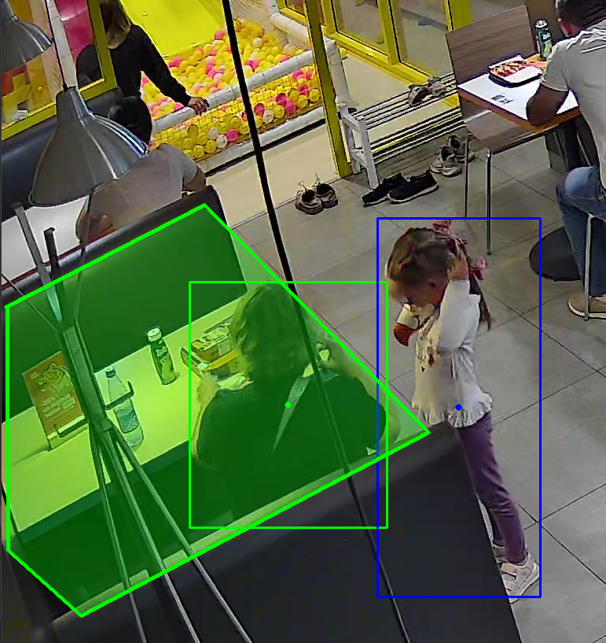

# 🧠 Прототип системы детекции занятости столика по видео

## 📌 Описание 

Прототип системы, которая анализирует видеопоток и определяет состояние конкретного столика:

- 🟩 стол свободен (EMPTY)
- 🔴 стол занят (OCCUPIED)
- Фиксируются события:
  - `APPROACH` — появление человека у стола
  - `TABLE_FREED` — освобождение столика

---

## ⚙️ Используемые технологии

- Python 3.12
- OpenCV — работа с видео и визуализация
- Pandas — обработка событий и аналитика
- Ultralytics YOLOv8 — детекция людей

---

## 📼 Медиафайлы

- Для обработки видео потока использовался видеофайл [Видео 1.mp4](https://drive.google.com/file/d/1pAPTjESoDgjqhTaqM_graYfMpWcOyzRe/view?usp=sharing)
- Перед запуском необходимо переместить файл в директорию вместе с main.py и переименовать в video1.mp4

## 🚀 Запуск проекта

### 1. Установка виртуального окружения и зависимостей
```commandline
python -m venv .venv
```
```commandline
.venv/scripts/activate
```
```bash
pip install -r requirements.txt
```
### 2. Запуск скрипта
```commandline
python main.py --video video1.mp4
```

## 🎯 Выбор столика

Для анализа выбран один столик, заданный вручную в виде многоугольника (polygon ROI):

polygon = [
    (5, 606),
    (258, 476),
    (543, 765),
    (101, 998),
    (8, 915),
    (7, 606)
]

## 🧠 Логика работы
1. Детекция

  - Используется модель YOLOv8 для обнаружения людей на каждом кадре.

2. Определение принадлежности к столу

- Для каждого обнаруженного человека:

  - вычисляется центр bounding box
  - проверяется попадание в polygon ROI через cv2.pointPolygonTest
3. Трекинг

- Реализован простой трекинг объектов:

  - сопоставление bounding box через IoU
  - хранение активных объектов
  - удаление "старых" треков
4. Стабилизация 

- Для борьбы с нестабильностью детекции используется:

  - temporal smoothing (скользящее окно deque)
  - гистерезис:
  - вход: ENTER_THRESHOLD
  - выход: EXIT_THRESHOLD 

- Это позволяет устранить "дребезг" при пропадании детекций.

5. Определение состояния

- Состояние определяется на основе доли кадров с присутствием человека:

  - 60% → OCCUPIED

  - < 30% → EMPTY
  - иначе → сохраняется предыдущее состояние


## 📈 Результат
  - Среднее время между уходом и подходом: 146.03 сек 
  - Общее время занятости: 00:53
  - [output.mp4]()

## 🎥 Визуализация
🔴 Полигон — стол занят

🟢 Полигон — стол свободен

Синие bounding box — обнаруженные люди


⚠️ 

YOLO может нестабильно детектировать людей:

со спины

при частичном перекрытии


